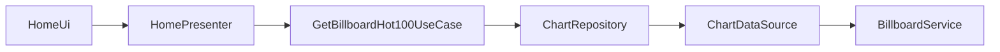
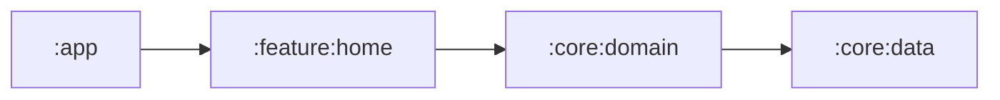
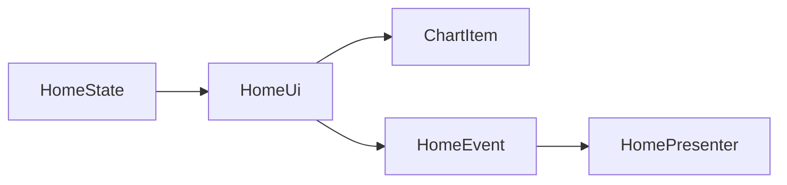

# PR Review Summary Skill

When all three reviewer sub-agents have returned their results, use this skill to post the final PR review in two parts:

1. **One summary comment at the PR top** (following the template below)
2. **Line-level review comments** for each issue with a `suggestion` block

## Step 1 — Aggregate reviewer results

Collect each reviewer's output. Expected fields per issue:
```
{ severity, confidence, file, line, message, suggestion, reviewer }
```

Map severity buckets:
- **Major** → confidence 91–100 (Critical)
- **Minor** → confidence 80–90 (Important)
- **Check** → confidence 70–79 (Observations; not posted as inline by default, listed only in summary)

Drop anything below 70.

## Step 2 — Gather PR metadata

```bash
gh pr view --json number,title,body,headRefName,baseRefName,changedFiles,additions,deletions,files,author
gh pr diff --name-only
git log origin/main..HEAD --oneline
```

From the file list, extract unique **module labels** (`:app`, `:feature:home`, `:core:data`, etc.) by matching path prefixes.

## Step 3 — Generate the summary body (Korean)

Use this exact template. Replace all `<...>` placeholders. Always write in Korean.

```markdown
# 📋 Billboard PR Review

## 🎯 리뷰 범위

| 항목 | 값 |
|---|---|
| Base | `<baseRefName>` |
| Head | `<headRefName>` |
| Commits | <N> |
| Files | <M> (+<additions> / -<deletions>) |
| Modules | <콤마로 나열된 모듈 라벨> |

## 📝 작업 요약

<PR title + PR body 에서 추출한 한 단락 요약 — 한국어로.
 PR body 가 비어있으면 커밋 메시지에서 요약을 생성.>

## 🔀 변경 흐름

<mermaid flowchart — 아래 "Mermaid 규칙" 참조>

## 📊 리뷰 결과

| Severity | Count | 설명 |
|---|---|---|
| 🔴 Major | <M> | 반드시 수정 필요 (confidence 91–100) |
| 🟡 Minor | <N> | 개선 권장 (confidence 80–90) |
| 🔵 Check | <K> | 참고 사항 (confidence 70–79) |

## 👁️ 리뷰어별 집계

| Reviewer | Model | Issues |
|---|---|---|
| 🔵 billboard-reviewer | opus | <n1> |
| 🟣 compose-reviewer | opus | <n2> |
| 🟠 module-boundary-checker | sonnet | <n3> |

## 📎 세부 지적

각 이슈는 아래 라인 코멘트를 참고해주세요.
<Major / Minor 가 0 이면 "이상 없음 ✅" 만 남기고 라인 코멘트 스킵>
```

## Step 4 — Mermaid rules

Produce a **flowchart LR** diagram that reflects the PR's data/control flow. Use one of these patterns based on what the PR touches:

**Pattern A — Feature layer change (Presenter + UseCase + Repository)**

Highlight changed nodes with `:::changed` and append `classDef changed fill:#fef3c7,stroke:#f59e0b` at the end.

**Pattern B — Module dependency change**


**Pattern C — Compose-only change (state → UI)**


**Pattern D — Build config / Gradle only**
Skip the mermaid diagram and write a short sentence: *"Gradle/빌드 설정 변경만 포함 — 흐름도 생략."*

Pick the pattern that best matches the PR. If multiple apply, use Pattern A with extra nodes. Keep it under 10 nodes — prune aggressively.

## Step 5 — Post the review via gh api

Use a single API call so the summary comment and all line comments appear as one atomic review:

```bash
gh api --method POST \
  /repos/:owner/:repo/pulls/:pr_number/reviews \
  --input - <<'EOF'
{
  "body": "<Korean summary body from Step 3>",
  "event": "COMMENT",
  "comments": [
    {
      "path": "feature/home/src/main/java/.../HomeState.kt",
      "line": 42,
      "body": "<짧은 한국어 설명>\n\n```suggestion\n<수정 코드>\n```"
    }
  ]
}
EOF
```

Rules:
- Use `event: "COMMENT"` — never `REQUEST_CHANGES` or `APPROVE` (bot should not gate merges)
- Each `comments[]` entry uses a GitHub **suggestion block** so the author can one-click "Commit suggestion"
- `line` is the **new file** line number in the diff
- **Skip metadata clutter**: no confidence scores, no reviewer names, no severity labels, no "CLAUDE.md rule #3" citations. All metadata lives in the summary comment only.
- **Two-layer comment structure** — main body stays scannable, detailed reasoning hides behind a `<details>` toggle so it does not overwhelm the reader but is available when needed:

  **Visible (top)**:
  - **What** is wrong — one precise sentence
  - **Short why** — one sentence on the core consequence
  - The ```suggestion``` block

  **Collapsed in `<details>`**:
  - **Deeper reasoning** — full explanation of the consequence (performance numbers, recomposition counts, architectural impact, etc.)
  - **What was checked** — which file(s), which section of CLAUDE.md or module CLAUDE.md, which pattern or convention this relates to, and how it connects to prior project history (e.g., a related past issue)
  - **Related references** — links to other files in the repo if helpful

  Markdown template for each inline comment body:

  ```markdown
  <what — 한 문장>. <short why — 한 문장>.

  ```suggestion
  <수정 코드>
  ```

  <details>
  <summary>📖 근거 보기</summary>

  <상세 설명 — 왜 이게 문제인지, 성능/정확성/관습 관점의 구체적 영향>

  **확인한 것**
  - `<파일경로>:<라인>` — <어떤 패턴을 확인했는지>
  - CLAUDE.md 의 <섹션명> 규칙
  - <관련 과거 이슈나 컨벤션이 있다면 언급>

  </details>
  ```

  Example rendered:

  > Compose State 에 raw `List<Chart>` 는 unstable 이라 차트 내용이 안 바뀌어도 recomposition 이 전파돼요. `ImmutableList` 로 바꿔주세요.
  >
  > ```suggestion
  >     val charts: ImmutableList<Chart>,
  > ```
  >
  > <details>
  > <summary>📖 근거 보기</summary>
  >
  > Compose 컴파일러는 `kotlin.collections.List` 를 unstable 로 취급합니다. State 가 `List<T>` 필드를 가지면 이 State 를 입력으로 받는 모든 `@Composable` 이 parameter stability 체크를 통과하지 못해, 같은 값이 들어와도 recomposition 을 스킵하지 못합니다. `kotlinx.collections.immutable.ImmutableList` (또는 `persistentListOf()`) 는 Compose 가 stable 로 인식하는 마커 인터페이스라, 참조가 같으면 recomposition 을 생략합니다.
  >
  > **확인한 것**
  > - `feature/home/src/main/java/.../HomeState.kt:42` — State class 에 raw `List` 필드
  > - 루트 CLAUDE.md 의 "State Management Rules" — `ImmutableList` / `persistentListOf()` 강제
  > - `core/data-impl/.../ChartRepositoryImpl.kt` 에서 이미 내부적으로 `persistentListOf()` 로 빌드 중이라 변환 비용도 0
  >
  > </details>

- Check-level findings (confidence 70–79) are not posted as inline comments — they live only in the summary

## Step 6 — Label and optional auto-merge

After the review comment is posted, always take these finalization actions:

### 6a — Always add `review-end` label

```bash
gh pr edit ${PR_NUMBER} --add-label "review-end"
```

This runs **regardless** of outcome (pass, fail, error). It marks the PR as "the reviewer bot has finished its work on this PR".

### 6b — Auto-merge when the review is clean

Compute the decision:

```
merge_eligible = (major_count == 0) AND (minor_count == 0)
```

Check guards. **Skip auto-merge** if any of these are true:
- The PR has a label named `do-not-merge` or `hold` or `wip`
- The PR is a draft (`gh pr view --json isDraft`)
- The PR has merge conflicts (`gh pr view --json mergeable` → not `MERGEABLE`)
- `merge_eligible` is false

If all checks pass, trigger auto-merge:

```bash
gh pr merge ${PR_NUMBER} --auto --squash --delete-branch
```

The `--auto` flag means GitHub will wait for all required checks to pass before actually merging — it does not merge immediately. If there are other workflows still running (e.g., `baseline-profile.yml` in a future session), those will gate the merge.

### 6c — Reflect the merge decision in the summary body

Prepend a one-liner at the very top of the summary body (Step 3) so humans can see the intent without scrolling:

- When auto-merge is queued:
  > ✅ **자동 머지 예약됨** — 남은 체크를 기다린 후 자동으로 머지돼요. 원치 않으면 `do-not-merge` 라벨을 붙여주세요.
- When auto-merge is skipped because of findings:
  > 🛑 **수동 머지 필요** — Major <M>, Minor <N> 건 검토 후 머지해주세요.
- When auto-merge is skipped because of a guard (draft / label / conflict):
  > ⏸ **자동 머지 스킵** — 이유: \<draft|do-not-merge 라벨|conflict\>

## Step 7 — Failure modes

- If a reviewer returned zero issues → still include their row in Step 3 table with count 0
- If the PR has zero total findings → post only the summary comment, no inline comments, with "이상 없음 ✅" in the 세부 지적 section, and proceed to Step 6b (auto-merge eligible)
- If `gh api` fails due to missing `pull-requests: write` permission → fall back to a single `gh pr comment` with the summary body and a bullet list of issues; still attempt Step 6a (label)
- If `gh pr merge` fails (e.g., branch protection rejects the bot) → log the error in the summary comment, keep the `review-end` label, and continue

## Rules

- Everything user-facing is in Korean
- Mermaid diagrams must be valid — test the syntax mentally before posting
- Never modify code — this skill only posts comments, labels, and merges
- Never post more than one review per workflow run (idempotency)
- Never use `gh pr merge` without `--auto` — direct merge bypasses other CI checks
- Never use `--admin` flag — never bypass branch protection
